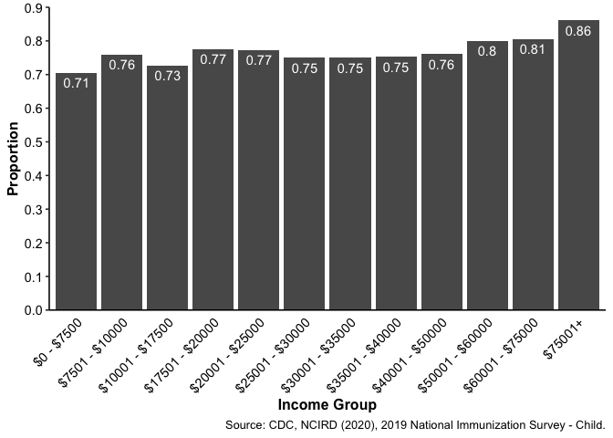

# Variation in the relationship between socioeconomic status and vaccinations in children over time

Kelsey Leach

Biosciences Department, Minnesota State University Moorhead, 1104 7th
Avenue South, Moorhead, MN 56563 USA

## Abstract

\#\#Introduction

## Methods

### Data Acquisition

This project used R Version 4.0.3 and R Studio Version 1.3.1093 (R Core
Team, 2020; R Studio Team, 2020). Data was obtained from the Center for
Disease Control. Data for the 2018 National Immunization Survey Child
Data was downloaded, including the Dataset, R Input Statements, and Data
User’s Guide (DHHS, 2020). The Dataset file includes the full data from
each participant in the survey. The R Input Statements file includes
code to appropriately label the data in the Dataset file (Harrell,
2020). The Data User’s Guide provides an explanation how the data was
obtained and the meaning of each variable in the dataset.

### Data Preparation

Data was extracted using the filter function to select variables
involving socioeconomic status and vaccination status (Wickham, 2019).
Variables included were up-to-date status on the hepatitis B, rotavirus,
haemophilus influenzae, pneumococcal conjugate, polio, influenza, MMR,
and heptatitis A vaccines, as well as household income group, poverty
status, and income to poverty ratio.

## Results

<!-- -->

## Discussion

## References

Frank E Harrell Jr, with contributions from Charles Dupont and many
others. (2020). Hmisc: Harrell Miscellaneous. R package version 4.4-2.
<https://CRAN.R-project.org/package=Hmisc>

R Core Team (2020). R: A language and environment for statistical
computing. R Foundation for Statistical Computing, Vienna, Austria. URL
<https://www.R-project.org/>.

RStudio Team (2020). RStudio: Integrated Development Environment for R.
RStudio, PBC, Boston, MA URL <http://www.rstudio.com/>.

U.S. Department of Health and Human Services (DHHS). National Center for
Immunization and Respiratory Diseases . The 2018 National Immunization
Survey-Child, Atlanta, GA : Centers for Disease Control and Prevention,
2020.

Wickham et al., (2019). Welcome to the tidyverse. Journal of Open Source
Software, 4(43), 1686, <https://doi.org/10.21105/joss.01686>

## Acknowledgements
